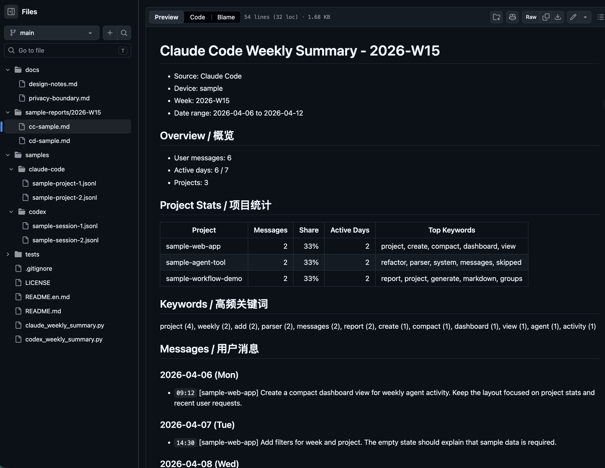

# Agent Trace Reporter

> English version: [README.en.md](README.en.md)

`Agent Trace Reporter` 是一个 local-first CLI 工具，用于把 AI Coding session logs 转换成按周聚合的 Markdown 复盘报告。

## 为什么做这个项目

AI Coding 的关键产出经常不只存在于最终 commit 里，也分散在 Claude Code / Codex 的本地 session trace 里。Prompt 里会包含任务背景、执行边界、调试路径、失败尝试、约束变化和最终决策。

Agent Trace Reporter 把这些本地 trace 转换成按周、项目和设备聚合的 Markdown 报告，让 AI Coding 过程更容易搜索、复盘和复用，同时不上传任何本地日志。

这个项目适合用来做 prompt 复用、workflow review、failure analysis，以及围绕 AI-assisted development 建立个人数据层。公开仓库只包含虚构 sample data。

## 它能做什么

- 解析 Claude Code JSONL logs。
- 解析 Codex JSONL logs。
- 过滤系统消息，只保留真实用户请求。
- 按 ISO week、project、device 聚合。
- 根据 `cwd` 推断项目名。
- 生成 Markdown 周报。
- 输出项目统计和高频关键词。

## 快速开始

本仓库不包含任何真实 session log。下面的命令只读取 `samples/` 里的虚构数据。

```bash
python claude_weekly_summary.py --device sample --input-dir samples/claude-code --output-dir sample-reports --week 2026-W15
python codex_weekly_summary.py --device sample --input-dir samples/codex --output-dir sample-reports --week 2026-W15
```

运行测试：

```bash
python -m unittest discover -s tests
```

## Sample Output

- [Claude Code sample report](sample-reports/2026-W15/cc-sample.md)
- [Codex sample report](sample-reports/2026-W15/cd-sample.md)



_由虚构 Claude Code / Codex sample logs 生成的周报预览，包含项目统计、高频关键词和按日期聚合的用户请求。_

## 这个项目展示什么

这个仓库用于展示：

- AI Coding workflow 的本地复盘能力。
- Agent trace 解析和结构化能力。
- failure analysis 的数据准备思路。
- local data processing 的工程边界。
- 面向开发者工具的设计取舍和隐私边界。

## 隐私边界

- **Local-first**：工具只处理本地文件。
- **No upload**：不会上传 session log。
- **No real logs in public repo**：公开仓库不包含真实 Claude Code / Codex 会话记录。
- **Sample data only**：`samples/` 和 `sample-reports/` 只包含虚构内容。
- **Disposable generated reports**：默认输出目录 `reports/` 被 `.gitignore` 忽略，用户可以随时删除。

更多说明见 [docs/privacy-boundary.md](docs/privacy-boundary.md)。

## CLI Usage

Claude Code:

```bash
python claude_weekly_summary.py --device sample --input-dir samples/claude-code --output-dir sample-reports --week 2026-W15
python claude_weekly_summary.py --device sample --input-dir samples/claude-code --output-dir sample-reports --all
```

Codex:

```bash
python codex_weekly_summary.py --device sample --input-dir samples/codex --output-dir sample-reports --week 2026-W15
python codex_weekly_summary.py --device sample --input-dir samples/codex --output-dir sample-reports --all
```

参数：

- `--input-dir`：JSONL 输入目录，demo 使用 `samples/`。
- `--output-dir`：Markdown 输出目录，默认 `reports/`。
- `--device`：设备标签，允许 `sample`、`air`、`pro`。
- `--week`：指定 ISO week，例如 `2026-W15`。
- `--all`：生成输入数据里的所有周。

## 授权

MIT License. See [LICENSE](LICENSE).
